# Frontend Mentor - Todo app solution

This is a solution to the [Todo app challenge on Frontend Mentor](https://www.frontendmentor.io/challenges/todo-app-Su1_KokOW). Frontend Mentor challenges help you improve your coding skills by building realistic projects. I added some extra features such as authentication, NoSQL cloud database, routing, and more.

## Table of contents

- [Overview](#overview)
  - [The challenge](#the-challenge)
  - [Screenshot](#screenshot)
  - [Links](#links)
- [My process](#my-process)
  - [Built with](#built-with)
- [Author](#author)

## Overview

### The challenge

Users should be able to:

- View the optimal layout for the app depending on their device's screen size
- See hover states for all interactive elements on the page
- Add new todos to the list
- Mark todos as complete
- Delete todos from the list
- Filter by all/active/complete todos
- Clear all completed todos
- Toggle light and dark mode
- **Bonus**: Drag and drop to reorder items on the list
- **Bonus**: Email and password based authentication

### Screenshot

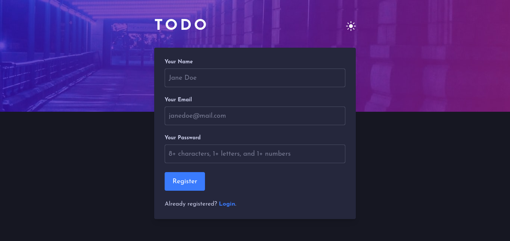
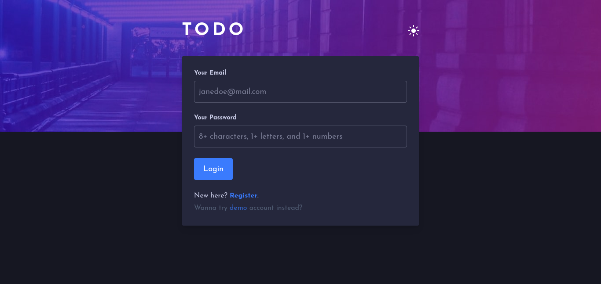
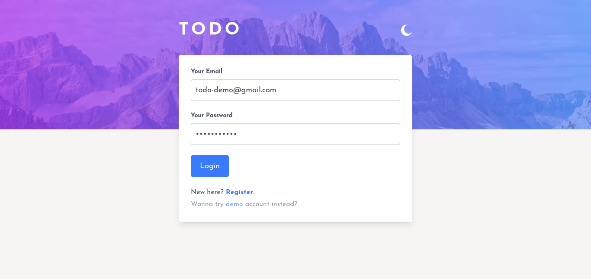
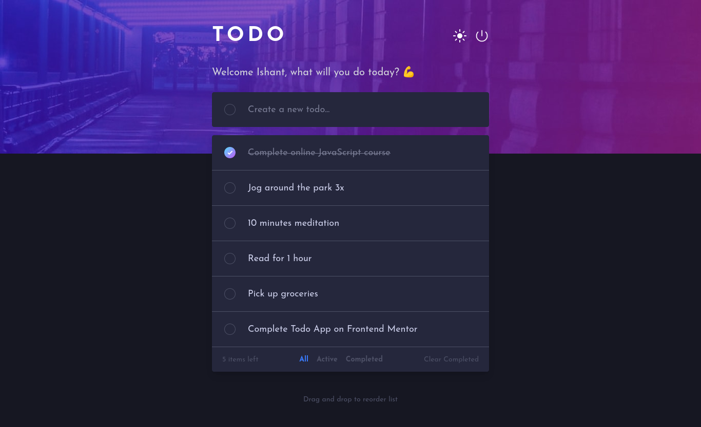
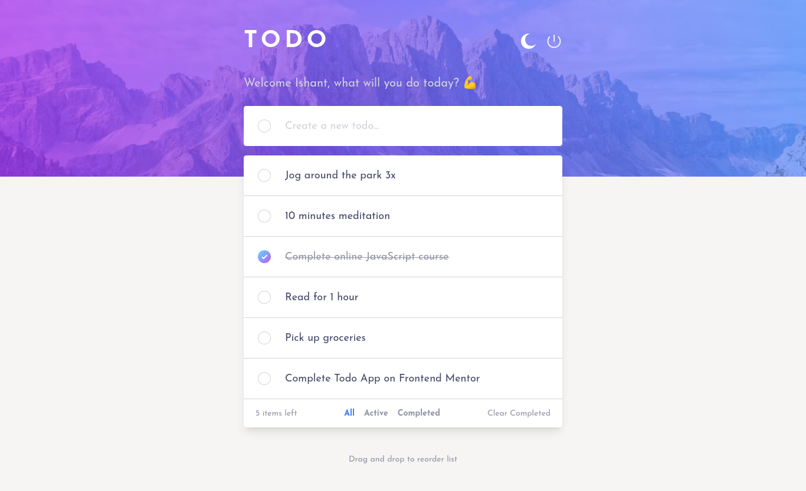
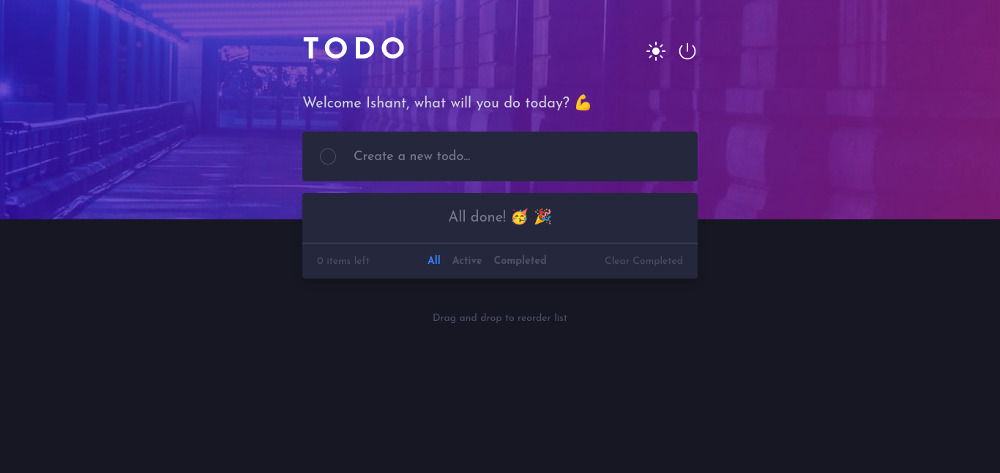
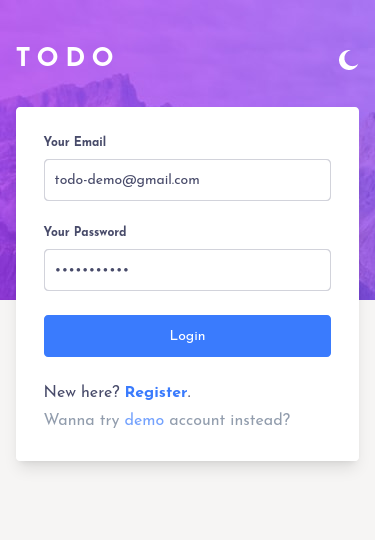
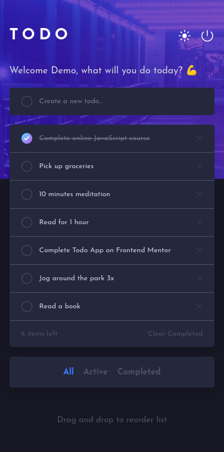
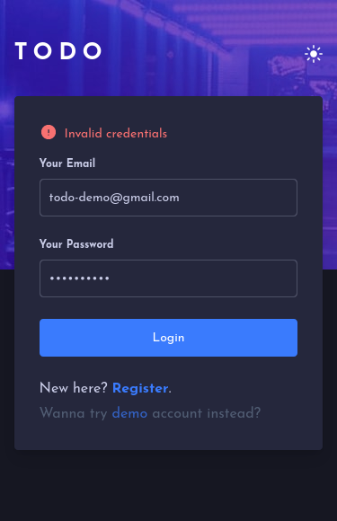
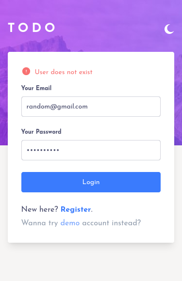
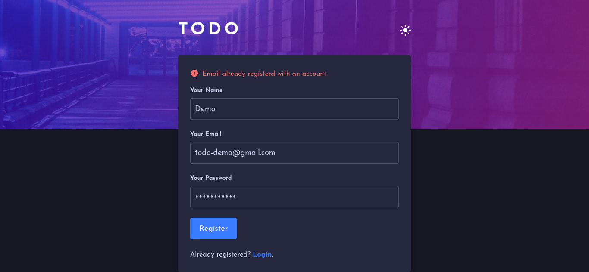

### Links

- Live Site URL: [https://react-todo-ts.netlify.app/](https://react-todo-ts.netlify.app/)

## My process

### Built with

- [React](https://reactjs.org/) - JS library
- [TypeScript](https://www.typescriptlang.org/) - Syntactic superset of JavaScript
- [TailwindCSS](https://tailwindcss.com/) - For styling
- [Firebase](https://firebase.google.com/) - For backend (authentication and firestore database)
- [React Router](https://reactrouter.com/) - For routing
- [react-beautiful-dnd](https://github.com/atlassian/react-beautiful-dnd) - For drag and drop to reorder list

## Author

- Twitter - [@IShaunt](https://twitter.com/IShaunt)
